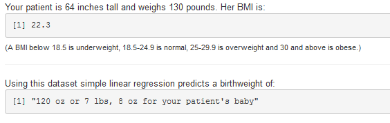

## What is an OP-aPT?

OP-aPT is EasyDataViz's name for the 'panels' that our company produces. OP-aPT stands for Online Predicting and Plotting Tool. The ['Mothers and Babies'](https://szmartin.shinyapps.io/newCourseProject/) panel is an example of an OP-aPT based on data publicly available from the [UsingR package](http://cran.r-project.org/web/packages/UsingR/UsingR.pdf). Let's review this simple example and demonstrate how it can be customized for your organization and data.     

As you can see on the next slide (or by going to ['Mothers and Babies'](https://szmartin.shinyapps.io/newCourseProject/)) the interface is easy to use and familiar to anyone who has used the Internet. The user input interface is completely customizable and can feature sliders, radio buttons, checkboxes, dropdown lists and numeric input fields. You decide which inputs matter to you, what the range of each variable is (typically derived from your data) and units of measurement (for example 'Mothers and Babies' uses non-metric units but this can be changed to metric easily). 

---

## Familiar User Input Interface

    

What information would you like to capture - patient age? Whether or not they are a smoker? Their blood pressure reading on the most recent clinic visit? We will work with you to customize this user input interface or link it to existing Electronic Health Record (EHR) applications.

---  

## Predicting functionality of OP-aPTs   

The information that the user enters can be used for a variety of prediction and/or calculation functions. For example, the 'Mothers and Babies' panel calculates the patient's Body Mass Index (BMI) from the height and weight entered and also displays the predicted birthweight for a baby whose mother has that BMI using a linear regression equation from the 'babies' dataset.  

For example, a woman who is 5 feet 5 inches tall (65 inches) and weighs 185 pounds has a BMI of 30.8 and a predicted weight of 123 oz or 7 lbs, 11 oz for her baby (the values shown in this sentence are calculated using the code that underlies the 'Mothers and Babies' panel and a different example captured from the screen is shown below). Wherever possible we have incorporated informational messages into our panels - as you see in the example below where we tell the user what different values of BMI represent.

---

## Plotting functionality of OP-aPTs   

Finally, the OP-aPT allows you to give your users visual access to your organization's data via a simple user input interface. If you'd like to learn more about how EasyDataViz can help you get more out of your data for everyone in your organization get in touch with us at [easydataviz.biz](easydatabiz.viz) or 1-800-EAS-YDTA (1-800-327-9382).  

